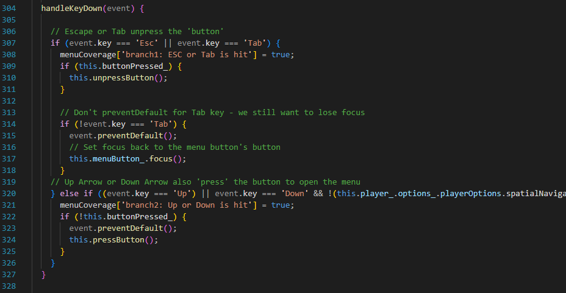
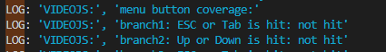
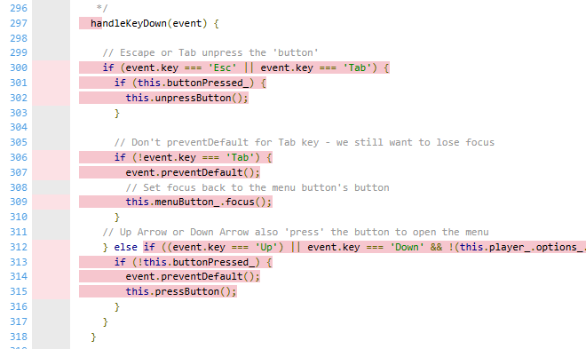
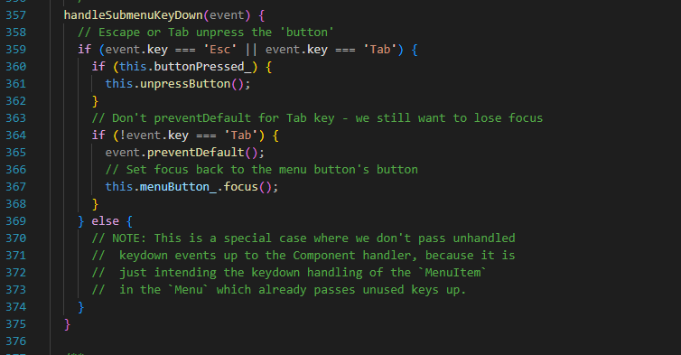
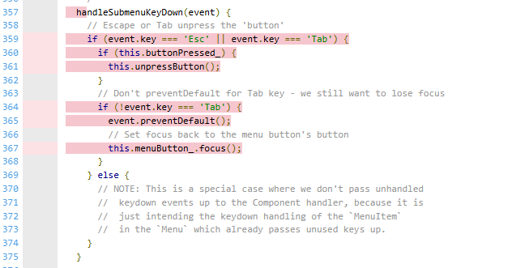
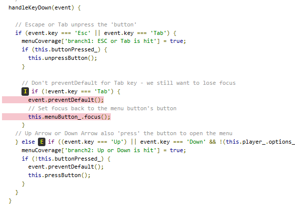
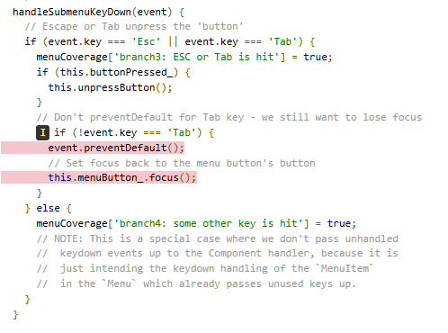

### Your own coverage tool
Hieu Nguyen Viet

Function 1: handleKeydown() in menu-button.js

The code before the instrumentation:

The code after the instrumentation:

Coverage results:

Function 2: handleSubmenuKeyDown() in menu-button.js

The code before the instrumentation:

The code after the instrumentation:

Coverage results:

## Coverage improvement

### Individual tests

Hieu Nguyen Viet

<Test 1>

[test/unit/menu.test.js](https://github.com/cukibe123/SEP-Group-46/commit/e9ab648893a67a62dcc9073888fb5aa9e687051d)
Old Coverage Results:

New Coverage Results:

The previous version of the test file did not cover the situation where the ESC or Tab was pressed. What we did was simply add tests in. The function coverage was 0% and we got it up to 85%.

<Test 2>

[test/unit/menu.test.js](https://github.com/cukibe123/SEP-Group-46/commit/e9ab648893a67a62dcc9073888fb5aa9e687051d)

Old Coverage Results:

New Coverage Results:

This coverage was basically the same and two tests was included to cover the cases where ESC or Tab is pressed.
****
