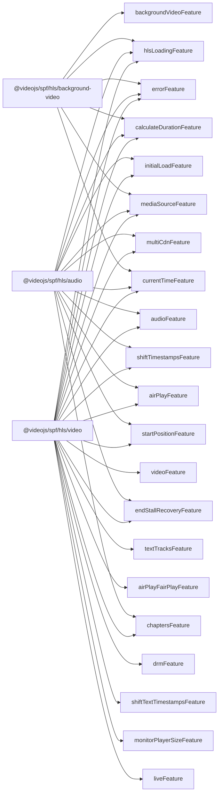

<!-- Generated by `pnpm -F @videojs/spf docs:reference`. Do not edit by hand; edit the JSDoc in the source. -->

# `@videojs/spf` API reference

Generated from the TypeScript sources and their JSDoc by `scripts/build-reference.ts`. It covers the composition factories the root entry exports from `src/core/composition/`, the playback engines (`@videojs/spf/hls/*`), their features (`@videojs/spf/hls/features/*`), and the behaviors (`@videojs/spf/behaviors/*`). It does not cover the root entry's other exports, nor these entry points: `@videojs/spf/dom`, `@videojs/spf/hls`, `@videojs/spf/media-tracks`, `@videojs/spf/hls-audio`, `@videojs/spf/hls-background-video`, `@videojs/spf/hls-video`.

Regenerate with `pnpm -F @videojs/spf docs:reference`; `pnpm -F @videojs/spf docs:reference:check` fails when the committed output is stale. A symbol without JSDoc reads "No description."

On feature and engine pages, a config key's doc is the config field JSDoc of the first behavior listed under "Read by" that has one, and a state or context key's doc is the field JSDoc from the first behavior that writes the key, else the first that reads it.

## Engines and features

## Core

| Symbol | Page | Description |
| --- | --- | --- |
| `Composition` | [create-composition](core/create-composition.md#composition) | A composition of behaviors with shared state and context signal maps. |
| `CompositionOptions` | [create-composition](core/create-composition.md#compositionoptions) | Options for `createComposition`. |
| `createComposition` | [create-composition](core/create-composition.md#createcomposition) | Create a composition from a set of behaviors. |
| `defineCompositionFactory` | [create-composition](core/create-composition.md#definecompositionfactory) | A create function for one fixed list of behaviors with its defaults: what an engine module exports as its `createEngine`. |
| `Behavior` | [define-behavior](core/define-behavior.md#behavior) | A behavior announces the state and context keys it needs alongside a `setup` function that receives deps (state, context, config) and returns an optional cleanup handle. |
| `BehaviorCleanup` | [define-behavior](core/define-behavior.md#behaviorcleanup) | Cleanup returned by a behavior. |
| `BehaviorDeps` | [define-behavior](core/define-behavior.md#behaviordeps) | The deps object passed to each behavior by the composition. |
| `ContextSignals` | [define-behavior](core/define-behavior.md#contextsignals) | A signal map keyed by the fields of `C`. |
| `InferBehaviorConfig` | [define-behavior](core/define-behavior.md#inferbehaviorconfig) | Infer the config shape a behavior requires from its deps parameter, whether it declares `config` or `config?`. |
| `InferBehaviorContext` | [define-behavior](core/define-behavior.md#inferbehaviorcontext) | Infer the context shape a behavior requires from its deps parameter. |
| `InferBehaviorState` | [define-behavior](core/define-behavior.md#inferbehaviorstate) | Infer the state shape a behavior requires from its deps parameter. |
| `ResolveBehaviorConfig` | [define-behavior](core/define-behavior.md#resolvebehaviorconfig) | Resolve the combined config shape from an array of behaviors (intersection of all requirements). |
| `ResolveBehaviorContext` | [define-behavior](core/define-behavior.md#resolvebehaviorcontext) | Resolve the combined context shape from an array of behaviors (intersection of all requirements). |
| `ResolveBehaviorState` | [define-behavior](core/define-behavior.md#resolvebehaviorstate) | Resolve the combined state shape from an array of behaviors (intersection of all requirements). |
| `StateSignals` | [define-behavior](core/define-behavior.md#statesignals) | A signal map keyed by the fields of `S`. |
| `defineBehavior` | [define-behavior](core/define-behavior.md#definebehavior) | Typed factory for behaviors that enforces single-behavior key/param consistency: declared `stateKeys` must equal `keyof S` (where `S` is inferred from the setup's `state` parameter type), and same for `contextKeys` / `C`. |
| `defineExternalSignals` | [define-external-signals](core/define-external-signals.md#defineexternalsignals) | Behavior factory that defines a composition's **external signals**: state and context keys set and updated from outside the composition (typically by an adapter) that no composed behavior declares, because the behaviors that consult them only read them, and read them optionally. |
| `Feature` | [define-feature](core/define-feature.md#feature) | One capability of a composition: the behaviors that implement it, with the config defaults and initial state they need. |
| `FlattenedFeatures` | [define-feature](core/define-feature.md#flattenedfeatures) | What `flattenFeatures` returns: the inputs `createComposition` and `defineCompositionFactory` take. |
| `defineFeature` | [define-feature](core/define-feature.md#definefeature) | Define a feature. |
| `flattenFeatures` | [define-feature](core/define-feature.md#flattenfeatures) | Flatten features into one behavior list, one `defaultConfig`, and one `initialState`, ready for `createComposition` or `defineCompositionFactory`. |

## Engines

| Symbol | Page | Description |
| --- | --- | --- |
| `@videojs/spf/hls/video` | [video](engines/video.md) | Create an HLS playback engine. |
| `@videojs/spf/hls/audio` | [audio](engines/audio.md) | Create an audio-only HLS playback engine. |
| `@videojs/spf/hls/background-video` | [background-video](engines/background-video.md) | Create a background-video playback engine. |

## Features

| Symbol | Page | Description |
| --- | --- | --- |
| `airPlayFeature` | [airplay](features/airplay.md) | Plays to AirPlay receivers (WebKit only; inert elsewhere), unless the user sets `disableRemotePlayback`. |
| `airPlayFairPlayFeature` | [airplay-fairplay](features/airplay-fairplay.md) | Plays FairPlay-protected content on an AirPlay receiver, negotiating the receiver's keys while a session holds. |
| `audioFeature` | [audio](features/audio.md) | Plays audio: resolves the selected rendition's playlist, switches renditions, and buffers and loads its segments. |
| `backgroundVideoFeature` | [background-video](features/background-video.md) | Plays one video rendition for the whole session: the largest that fits the screen, picked once rather than adapted to bandwidth. |
| `calculateDurationFeature` | [calculate-duration](features/calculate-duration.md) | Calculates the presentation's duration from its selected tracks once they've loaded. |
| `chaptersFeature` | [chapters](features/chapters.md) | Adds the source's Apple JSON chapters (`EXT-X-SESSION-DATA`, `com.apple.hls.chapters`) to the media element as a hidden `chapters` text track per language. |
| `currentTimeFeature` | [current-time](features/current-time.md) | Mirrors the media element's `currentTime` into state, which segment loading reads to plan what to load next. |
| `drmFeature` | [drm](features/drm.md) | Plays DRM-protected content through Encrypted Media Extensions: negotiates a key system over the configured license servers, attaches its MediaKeys, and exchanges licenses. |
| `endStallRecoveryFeature` | [end-stall-recovery](features/end-stall-recovery.md) | Fires the media element's `ended` when Chrome freezes the playhead a few frames short of the end of a stream whose audio and video end at slightly different times. |
| `errorFeature` | [error](features/error.md) | Collects the errors the other features report into `state.errors`, per source. |
| `hlsLoadingFeature` | [hls-loading](features/hls-loading.md) | Fetches and parses the source's HLS multivariant playlist into the presentation the other features read. |
| `initialLoadFeature` | [initial-load](features/initial-load.md) | Defers loading until the media element's `preload` allows it or the user plays or seeks, mirroring native `HTMLMediaElement` preload behavior. |
| `liveFeature` | [live](features/live.md) | Plays live streams: reloads their playlists, keeps the seekable window current, starts at the live edge, and keeps the playhead inside the window. |
| `mediaSourceFeature` | [media-source](features/media-source.md) | Plays through Media Source Extensions: attaches a MediaSource to the media element, keeps its duration current, and ends the stream once every composed track type has loaded its last segment. |
| `monitorPlayerSizeFeature` | [monitor-player-size](features/monitor-player-size.md) | Monitors the player's rendered size, which enables capping video quality to it: the video selection rules' player resolution cap reads the size and does nothing without it. |
| `multiCdnFeature` | [multi-cdn](features/multi-cdn.md) | Plays sources served from several CDNs (redundant streams): keeps every track type on one CDN, and fails over to the next when a CDN fails, returning to it once its cooldown lapses. |
| `shiftTextTimestampsFeature` | [shift-text-timestamps](features/shift-text-timestamps.md) | Shifts text cues onto the playlist's zero-based timeline along with the audio and video, rebasing each cue by the shift `shiftTimestampsFeature` establishes. |
| `shiftTimestampsFeature` | [shift-timestamps](features/shift-timestamps.md) | Plays HLS content whose segment timestamps don't start at zero, by shifting them onto the playlist's zero-based timeline. |
| `startPositionFeature` | [start-position](features/start-position.md) | Starts playback at `state.startPosition` instead of zero. |
| `textTracksFeature` | [text-tracks](features/text-tracks.md) | Adds the source's subtitle and caption renditions to the media element as text tracks and loads the WebVTT cues of the showing one. |
| `videoFeature` | [video](features/video.md) | Plays video with adaptive bitrate: resolves the selected rendition's playlist, switches renditions as bandwidth changes, and buffers and loads its segments. |

## Behaviors

| Symbol | Page | Description |
| --- | --- | --- |
| `calculatePresentationDuration` | [behaviors/calculate-presentation-duration](behaviors/calculate-presentation-duration.md#calculatepresentationduration) | **Populate presentation duration via a config-supplied resolver.** |
| `collectErrors` | [behaviors/collect-errors](behaviors/collect-errors.md#collecterrors) | **Owns the engine's error sequence.** Reporters append through `emitError`; this behavior owns the slot and its per-source lifecycle, clearing it on exit so a new source starts clean and the sequence can't grow unbounded across a session. |
| `deriveCdnPriority` | [behaviors/derive-cdn-priority](behaviors/derive-cdn-priority.md#derivecdnpriority) | **Session-level CDN priority.** While a presentation is resolved, owns the `cdnPriority` signal: the distinct CDNs the source is served from (origin of each track's URL), in manifest priority order — most-preferred first. |
| `establishStartMediaTime` | [behaviors/establish-start-media-time](behaviors/establish-start-media-time.md#establishstartmediatime) | Establish the presentation's coordinate origin — the `startTime` / `startMediaTime` / `startDate` triple — once per source, so every track lands on one 0-based presentation timeline. |
| `resolveAudioTrack` | [behaviors/resolve-track](behaviors/resolve-track.md#resolveaudiotrack) | Resolve unresolved audio tracks. |
| `resolvePresentation` | [behaviors/resolve-presentation](behaviors/resolve-presentation.md#resolvepresentation) | **Resolve an unresolved presentation by fetching and parsing its manifest.** |
| `resolveTextTrack` | [behaviors/resolve-track](behaviors/resolve-track.md#resolvetexttrack) | Resolve unresolved text tracks. |
| `resolveVideoTrack` | [behaviors/resolve-track](behaviors/resolve-track.md#resolvevideotrack) | Resolve unresolved video tracks. |
| `selectAudioTrack` | [behaviors/select-tracks](behaviors/select-tracks.md#selectaudiotrack) | Select an audio track when a presentation loads. |
| `selectVideoTrack` | [behaviors/select-tracks](behaviors/select-tracks.md#selectvideotrack) | **Default audio/video track selection on src load / unselect on src unload.** When a presentation is resolved, sets `selectedVideoTrackId` / `selectedAudioTrackId` from a per-type default rule chain if no selection already exists. |
| `setupFailoverMonitor` | [behaviors/setup-failover-monitor](behaviors/setup-failover-monitor.md#setupfailovermonitor) | **CDN failover cooldown.** The expiry half of multi-CDN failover. |
| `switchAudioTrack` | [behaviors/track-switching](behaviors/track-switching.md#switchaudiotrack) | Manage `selectedAudioTrackId`: pick a default on src load, narrow by `userAudioTrackSelection` filter, re-pick on filter change, clear on src unload. |
| `switchTextTrack` | [behaviors/track-switching](behaviors/track-switching.md#switchtexttrack) | Manage `selectedTextTrackId` as the single-writer **output** of standing user intent (`userTextTrackSelection`) resolved against the playable, CDN-scoped text renditions: clear on src unload; re-resolve when a CDN fails or recovers. |
| `switchVideoTrack` | [behaviors/track-switching](behaviors/track-switching.md#switchvideotrack) | **Per-type track selection as a rule chain.** While a presentation is resolved, owns that type's `selected{Video,Audio,Text}TrackId` signal: pick a default, react to user intent and algorithmic ranking, and clear it on src unload. |
| `syncPreload` | [behaviors/sync-preload](behaviors/sync-preload.md#syncpreload) | **Bidirectional sync between `state.preload` and `mediaElement.preload`.** |

## Behaviors (DOM)

| Symbol | Page | Description |
| --- | --- | --- |
| `applyStartPosition` | [behaviors/dom/apply-start-position](behaviors/dom/apply-start-position.md#applystartposition) | **Start playback of a source at a requested position.** `state.startPosition` is a one-shot command — "when the current source can seek, start there" — the SPF analogue of hls.js's `startPosition` (and the primitive `EXT-X-START`, resume-where-you-left-off, and MediaSource-recovery restore build on). |
| `endOfStream` | [behaviors/dom/end-of-stream](behaviors/dom/end-of-stream.md#endofstream) | **Drive each `open → ended` transition of the MediaSource.** Calls `MediaSource.endOfStream()` once every active buffer actor's currently-loading track is _complete_ (finite `Track.duration` — the parser's completeness signal), its temporally last segments are fully appended, and the user has reached them — letting the browser finalize duration and fire `ended` on the media element. |
| `exchangeLicenses` | [behaviors/dom/exchange-licenses](behaviors/dom/exchange-licenses.md#exchangelicenses) | **Open MediaKeySessions for the negotiated key system and exchange their licenses.** Preconditions on the handoff `setupMediaKeys` publishes — attached `context.mediaKeys` plus `state.negotiatedKeySystem` — so entry implies the CDM is negotiated, its server certificate applied, and the MediaKeys attached; the "certificate before `generateRequest`" ordering rides that handoff rather than a position in a shared function body. |
| `loadAudioSegments` | [behaviors/dom/load-segments](behaviors/dom/load-segments.md#loadaudiosegments) | No description. |
| `loadChapters` | [behaviors/dom/load-chapters](behaviors/dom/load-chapters.md#loadchapters) | **Project Apple JSON chapters onto the host media element.** When the resolved presentation carries an `#EXT-X-SESSION-DATA` entry for `com.apple.hls.chapters`, fetch the document it points at, parse it, and add one hidden `<track kind="chapters">` per title language — cues and all — to `mediaElement`. |
| `loadTextTrackSegments` | [behaviors/dom/load-segments](behaviors/dom/load-segments.md#loadtexttracksegments) | No description. |
| `loadVideoSegments` | [behaviors/dom/load-segments](behaviors/dom/load-segments.md#loadvideosegments) | **Per-type segment loading dispatch.** Per available track type (video / audio / text), reads the per-type segment-loader actor from context and sends typed `'load'` messages whenever a meaningful loading condition changes (selected track, current time crossing a segment boundary). |
| `recoverEndStall` | [behaviors/dom/recover-end-stall](behaviors/dom/recover-end-stall.md#recoverendstall) | Recover the end-of-stream stall that Chrome exhibits on skewed A/V. |
| `seekToLiveEdge` | [behaviors/dom/seek-to-live-edge](behaviors/dom/seek-to-live-edge.md#seektoliveedge) | Keep the playhead in the live window, via a two-state reactor gated on the preconditions for "we know where live is": |
| `setupAirPlay` | [behaviors/dom/airplay](behaviors/dom/airplay.md#setupairplay) | **Bridge MSE playback to AirPlay on WebKit.** MSE streams can't be handed to an AirPlay receiver directly. |
| `setupAirPlayFairPlay` | [behaviors/dom/setup-airplay-fairplay](behaviors/dom/setup-airplay-fairplay.md#setupairplayfairplay) | **Serve an AirPlay receiver's FairPlay key requests.** During an AirPlay session WebKit takes playback off MSE and onto the native-HLS fallback `<source>` `setupAirPlay` appends, and the receiver raises its own key requests through the sender's CDM as `skd`. |
| `setupAudioBufferActors` | [behaviors/dom/setup-buffer-actors](behaviors/dom/setup-buffer-actors.md#setupaudiobufferactors) | Set up the audio `SourceBufferActor` + `SegmentLoaderActor`. |
| `setupMediaKeys` | [behaviors/dom/setup-media-keys](behaviors/dom/setup-media-keys.md#setupmediakeys) | **Negotiate a key system and attach its MediaKeys for the current source.** Once an encrypted rendition has resolved against a media element, negotiate one composed key system over the configured license servers, apply its server certificate when it configures one, and attach the resulting MediaKeys — so licensing can begin. |
| `setupMediaSource` | [behaviors/dom/setup-mediasource](behaviors/dom/setup-mediasource.md#setupmediasource) | **Own the MediaSource lifecycle for the current source.** When a resolved presentation and a mediaElement are both in scope, creates a MediaSource, attaches it to the element, waits for `'open'`, and publishes it on `context.mediaSource`. |
| `setupTextTrackActors` | [behaviors/dom/setup-text-track-actors](behaviors/dom/setup-text-track-actors.md#setuptexttrackactors) | **Own the TextTracks actor pair for the current `mediaElement`.** When a `mediaElement` is in scope, creates the `TextTracksActor` (bound to the element's `textTracks`) and the `TextTrackSegmentLoaderActor` (bound to that actor + the injected cue resolver), and publishes both on `context`. |
| `setupVideoBufferActors` | [behaviors/dom/setup-buffer-actors](behaviors/dom/setup-buffer-actors.md#setupvideobufferactors) | **Per-type buffer + segment-loader actor setup.** Per available track type (video / audio), when `mediaSource` is attached and the selected track of that type is present in the presentation with codecs (partial resolution from the multivariant playlist is enough — codecs live on the `EXT-X-STREAM-INF` line, not in the per-type media playlist), creates a `SourceBuffer`, a `SourceBufferActor`, and a `SegmentLoaderActor` bound to that buffer-actor; publishes the per-type actor slots. |
| `syncLiveSeekableRange` | [behaviors/dom/sync-live-seekable-range](behaviors/dom/sync-live-seekable-range.md#syncliveseekablerange) | Mirror the live window into the MediaSource's seekable range. |
| `syncTextTracks` | [behaviors/dom/sync-text-tracks](behaviors/dom/sync-text-tracks.md#synctexttracks) | **Own the text-track slots on the host media element, mirroring the SPF model.** When a presentation is resolved and a media element is available, allocate one slot in `mediaElement.textTracks` per model text track — via creating `<track>` children, since that's the only spec mechanism for adding _and_ removing entries to `textTracks` (no `removeTextTrack` API exists). |
| `trackCurrentTime` | [behaviors/dom/track-current-time](behaviors/dom/track-current-time.md#trackcurrenttime) | Mirror `mediaElement.currentTime` into reactive state. |
| `trackLoadTriggers` | [behaviors/dom/track-load-triggers](behaviors/dom/track-load-triggers.md#trackloadtriggers) | No description. |
| `trackPlaybackRate` | [behaviors/dom/track-playback-rate](behaviors/dom/track-playback-rate.md#trackplaybackrate) | Mirror `mediaElement.playbackRate` into reactive state. |
| `trackPlayerResolution` | [behaviors/dom/track-player-resolution](behaviors/dom/track-player-resolution.md#trackplayerresolution) | Mirror the player element's rendered pixel dimensions into reactive state, so a rendition cap can narrow candidates to what the element can actually show without reading the DOM at pick time — which would make the picker impure, and would never re-pick when the element resized. |
| `trackScreenResolution` | [behaviors/dom/track-screen-resolution](behaviors/dom/track-screen-resolution.md#trackscreenresolution) | Mirror the screen's pixel dimensions into reactive state, so a rendition cap can narrow candidates to what the screen can actually show without reading the environment at pick time — which would make the picker impure, and would never re-pick when the screen changed. |
| `updateMediaSourceDuration` | [behaviors/dom/update-mediasource-duration](behaviors/dom/update-mediasource-duration.md#updatemediasourceduration) | **Propagate `presentation.duration` to `mediaSource.duration` — exactly once per MediaSource.** |
