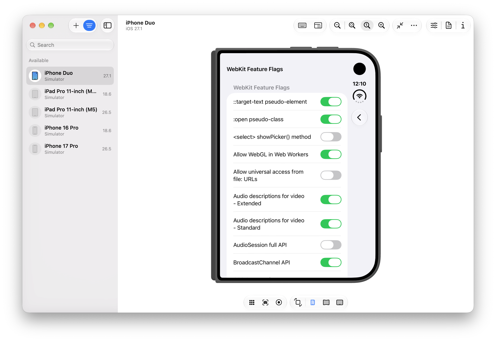
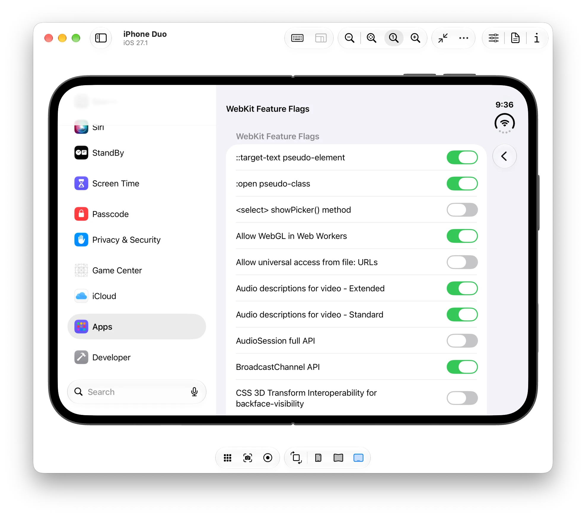
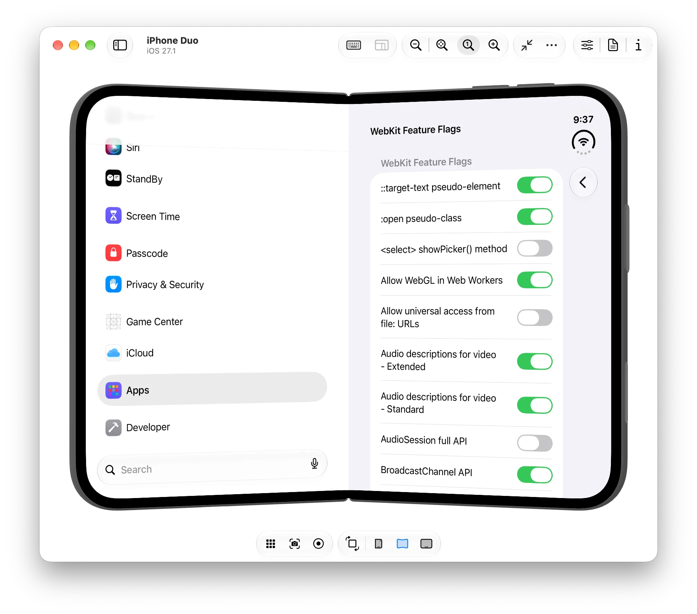
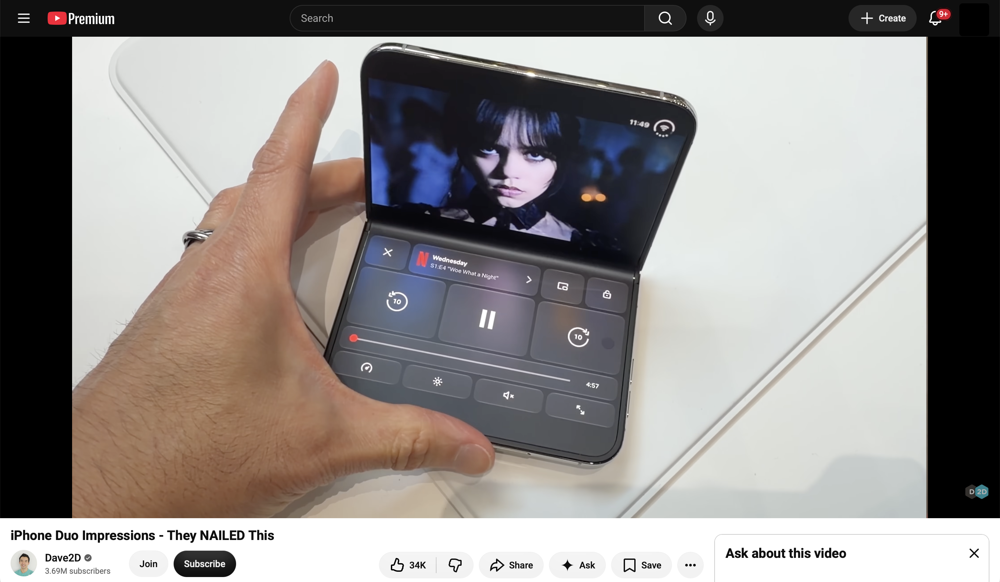
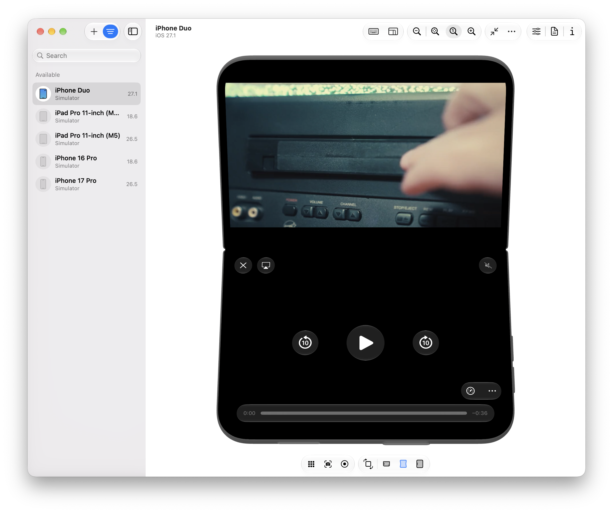
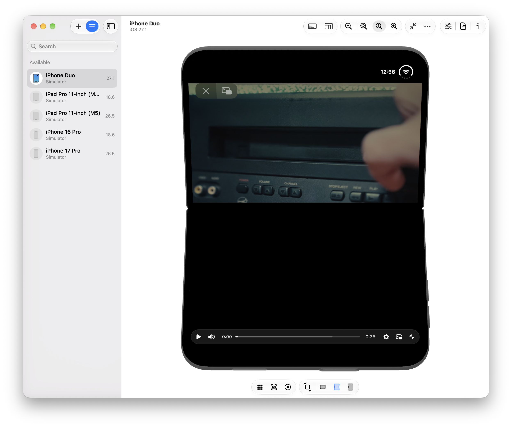
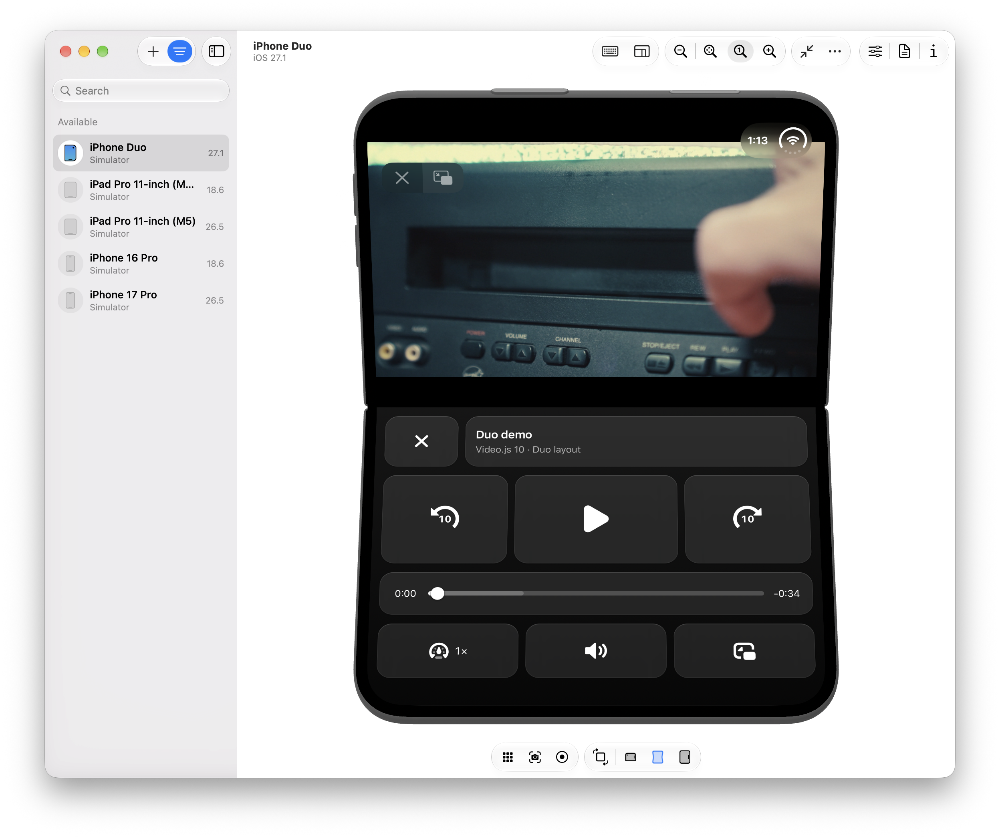
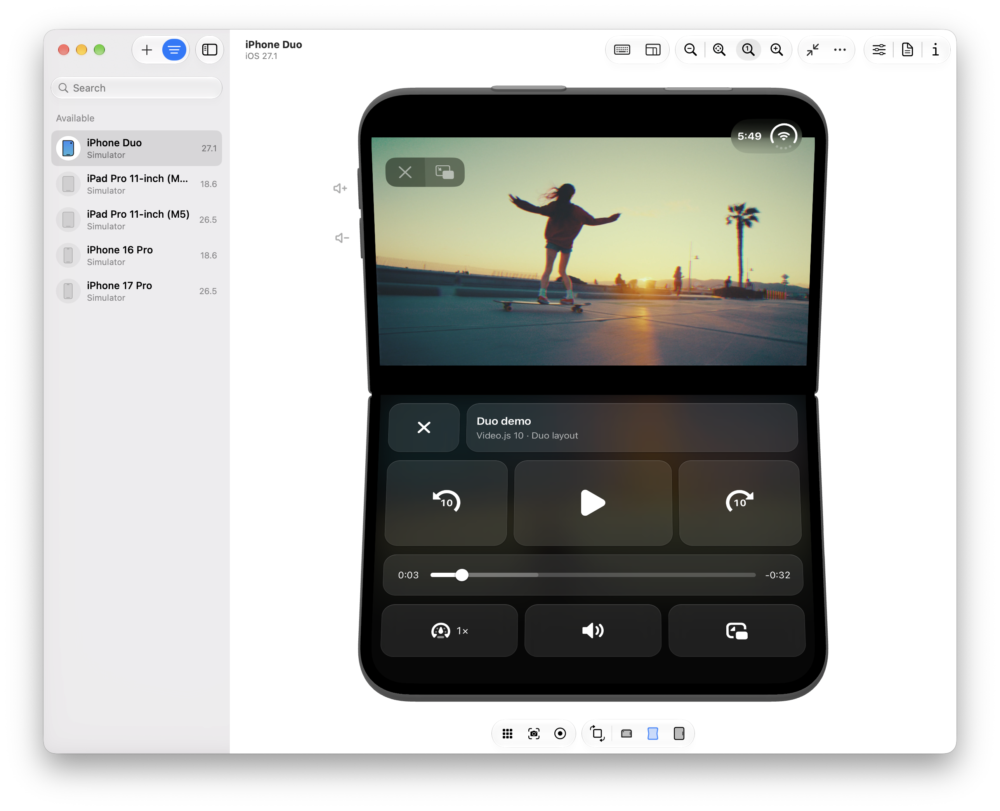
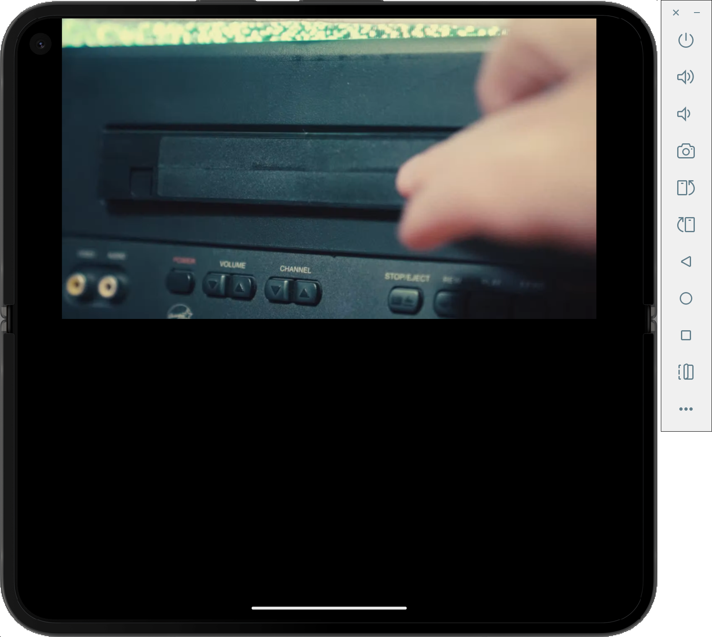

import Grid from '@/components/Grid.astro';
import Figure from '@/components/typography/Figure.astro';

You would think our first post after the [Video.js v10.0.0 release](/blog/videojs-10) would be some fascinating deep dive on our composable architecture, or our compiler, or maybe a multi-part series on our library agentic experience research.

But you know what? We've been working really hard to get Video.js out the door. So instead of writing a real blog post, I decided to spend the weekend on a little side project: digging into the web APIs that we'll have access to on the iPhone Duo.

I know, I know, this kind of folding stuff has been kicking around on Android for years. But I've been an iOS user since my beloved HTC One died over ten years ago. And now, ~~Tim~~ John Apple has finally decreed it to be my turn to fold a phone.

And I'm excited for my turn. Not only for the joy of once again having a small phone (iPhone mini, i miss u 🥺). But also for what this means for developers. Apple [released six videos](https://developer.apple.com/iphone-duo/) on building great apps for the iPhone Duo. The videos cover APIs that tell you about the device's physical characteristics and state, and they're brimming with design inspiration for the types of apps and interactions developers can build now.

But this is Apple. Did they leave any scraps for us web developers?

## What web APIs are available for the iPhone Duo?

After downloading [Xcode 27.1 beta](https://developer.apple.com/download/applications/)[^xcode], I immediately fired up the ~~simulator~~ Device Hub, booted an iPhone Duo, beelined for the settings, and dug into the feature flags.[^feature-flags]



I *love* feature flags. This list is an absolute toy box of the future of the web; the cool features that *maybe, someday* we'll get to play with. I pause and look up a few as I pass by. Like, what the heck is [CSS Rhythmic Sizing](https://www.w3.org/TR/css-rhythm-1/)??

But no. I've got to focus. I'm here for two specific things. And after a bit of scrolling, I find them. The Device Posture API and the Viewport Segment API.

### The Device Posture API

The [Device Posture API](https://developer.mozilla.org/en-US/docs/Web/API/Device_Posture_API) basically tells you whether the display you're looking at is `continuous` (e.g., your normie screen, flat or curved, *so* 2018) or `folded` (e.g., a folding phone *partially* folded, like a laptop). This works in JavaScript — `navigator.devicePosture` — or in CSS — `@media (device-posture: folded)`.

### The Viewport Segments API

The [Viewport Segments API](https://developer.mozilla.org/en-US/docs/Web/API/Viewport_segments_API) tells you about the individual regions of your display. In JavaScript, `window.viewport.segments` gives you an array of [`DOMRect`s](https://developer.mozilla.org/en-US/docs/Web/API/DOMRect) telling you about the size, shape, and location of the segments.

In CSS, you can learn about segments in two ways. First, `@media (horizontal-viewport-segments: n)` and `@media (vertical-viewport-segments: n)` let you respond to the number of (you guessed it) horizontal and vertical viewport segments. Second, you can access the position and size of any segment with [CSS environment variables](https://developer.mozilla.org/en-US/docs/Web/CSS/Reference/Values/env#viewport-segment-width). Want to access the width of the top-right segment? `env(viewport-segment-width 1 0)` will get you there. (The first number is the horizontal index, the second is vertical).

Let's say, for example, you have a full-bleed two-column layout that you want to snap to the segments when the screen is folded so your content doesn't go in the crease. You might write something like this…

```css
.layout {
  display: grid;
  grid-template-columns: 1fr 2fr;
}

@media (horizontal-viewport-segments: 2) {
  .layout {
    grid-template-columns:
      env(viewport-segment-width 0 0)
      env(viewport-segment-width 1 0);

    /* and leave room for the hinge! */
    column-gap: calc(
      env(viewport-segment-left 1 0) -
      env(viewport-segment-right 0 0)
    );
  }
}
```

Which would create an effect like this

<Grid class="mx-auto my-8 max-w-3xl [&_img]:my-0 [&_p]:my-0">





</Grid>

## Building a web video player for folding phones

Ok, that's all fine and good, but let me tell you why we're *really* here. After the Apple media event, I saw a few folks try out the new Netflix app for iPhone Duo and the folded player made perfect sense. Video in the top half, controls in the bottom, and a subtle flourish that reflected the video onto the bottom screen.

<Figure>



<figcaption>Screenshot from Dave2D's ["iPhone Duo Impressions – They NAILED This"](https://www.youtube.com/watch?v=CEgynoERrqc).</figcaption>

</Figure>

Having spent the year in Video.js, obviously my first thought was "can we do this?"

The short answer is "no". Despite an open Duo being *basically* an iPad, Apple *still* doesn't allow our elements in fullscreen. We're stuck with native controls.



But that's a boring end to a blog post. And for some reason, the Fullscreen API *is* available as a feature flag. So I go in and enable it… and…



omg are those Video.js controls in full screen on the iPhone Duo?? I don't think it takes too much imagination to figure out what comes next.

Let's see if I can reproduce the Netflix UI with Video.js components and CSS.

### Putting controls on the bottom screen

I start by grabbing a [Video.js skin with the shadcn CLI](/docs/guides/installation/shadcn?framework=html) and adding a whole new section to it.[^duplicate]

```html title="components/videojs/video/skin.html"
<!-- somewhere inside media-container, a bunch of new controls. -->
<div class="duo-controls">
  <div class="duo-row duo-row-top">
    <media-fullscreen-button class="duo-tile duo-close">
      <media-icon name="close" class="media-button-icon"></media-icon>
    </media-fullscreen-button>
    <div class="duo-tile duo-title-tile">
      <media-title class="duo-title"></media-title>
      <span class="duo-subtitle">Video.js 10 · Duo layout</span>
    </div>
    <media-airplay-button class="duo-tile media-airplay-button">
      <media-icon name="airplay-enter" class="media-button-icon media-airplay-button-enter-icon"></media-icon>
      <media-icon name="airplay-exit" class="media-button-icon media-airplay-button-exit-icon"></media-icon>
    </media-airplay-button>
  </div>

  <div class="duo-row duo-row-transport">
    <media-seek-button seconds="-10" class="duo-tile duo-seek">
      <media-icon name="seek" class="media-button-icon duo-seek-icon"></media-icon>
      <span class="duo-seek-amount" aria-hidden="true">10</span>
    </media-seek-button>
    <media-play-button class="duo-tile duo-play media-play-button">
      <media-icon name="restart" class="media-button-icon media-play-button-restart-icon"></media-icon>
      <media-icon name="play" class="media-button-icon media-play-button-play-icon"></media-icon>
      <media-icon name="pause" class="media-button-icon media-play-button-pause-icon"></media-icon>
    </media-play-button>
    <media-seek-button seconds="10" class="duo-tile duo-seek">
      <media-icon name="seek" class="media-button-icon duo-seek-icon"></media-icon>
      <span class="duo-seek-amount" aria-hidden="true">10</span>
    </media-seek-button>
  </div>

  <div class="duo-row duo-row-timeline">
    <div class="duo-tile duo-timeline">
      <media-time type="current" class="media-time-value"></media-time>
      <media-time-slider class="media-slider duo-time-slider">
        <media-slider-track class="media-slider-track">
          <media-slider-buffer class="media-slider-buffer"></media-slider-buffer>
          <media-slider-fill class="media-slider-fill"></media-slider-fill>
        </media-slider-track>
        <media-slider-thumb class="media-slider-thumb"></media-slider-thumb>
      </media-time-slider>
      <media-time type="remaining" class="media-time-value"></media-time>
    </div>
  </div>

  <div class="duo-row duo-row-bottom">
    <media-playback-rate-button class="duo-tile duo-rate">
      <media-icon name="speed" class="media-button-icon"></media-icon>
    </media-playback-rate-button>
    <media-captions-button class="duo-tile media-captions-button">
      <media-icon name="captions-off" class="media-button-icon media-captions-button-off-icon"></media-icon>
      <media-icon name="captions-on" class="media-button-icon media-captions-button-on-icon"></media-icon>
    </media-captions-button>
    <media-mute-button class="duo-tile media-mute-button">
      <media-icon name="volume-off" class="media-button-icon media-mute-button-off-icon"></media-icon>
      <media-icon name="volume-low" class="media-button-icon media-mute-button-low-icon"></media-icon>
      <media-icon name="volume-high" class="media-button-icon media-mute-button-high-icon"></media-icon>
    </media-mute-button>
    <media-pip-button class="duo-tile media-pip-button">
      <media-icon name="pip-enter" class="media-button-icon media-pip-button-enter-icon"></media-icon>
      <media-icon name="pip-exit" class="media-button-icon media-pip-button-exit-icon"></media-icon>
    </media-pip-button>
  </div>
</div>
```

I also need some extra controls and icons to match that Netflix UI, so I add just a bit more JS:

```ts title="duo-controls.ts"
import './duo-controls.css';
import { registerIcons, seekIcon } from '@videojs/html/icons';

/* controls not included in the default skin */
import '@videojs/html/ui/seek-button';
import '@videojs/html/ui/playback-rate-button';

/* icons not included in the default skin */
registerIcons('default', {
  seek: seekIcon,
  close:
    '<svg xmlns="http://www.w3.org/2000/svg" width="18" height="18" fill="none" aria-hidden="true" viewBox="0 0 18 18">' +
    '<path stroke="currentColor" stroke-linecap="round" stroke-width="2" d="M4.5 4.5l9 9m0-9-9 9"/>' +
    '</svg>',
});
```

And from here? If you've been paying attention, this CSS shouldn't be too surprising. We check to see if we're in a vertical, folded posture, and we position the video and controls.[^segments]

```css title="duo-controls.css"
/* normally, our duo controls are hidden */
.duo-controls {
  display: none;
}

/* but when we're partially folded... */
@media (device-posture: folded) and (vertical-viewport-segments: 2) {
  /* stuff that should be in the top half */
  .video-skin:fullscreen > :is(video, .media-poster, .media-buffering-indicator, .video-status-indicators) {
    position: absolute;
    inset-inline: 0;
    top: env(viewport-segment-top 0 0);
    height: env(viewport-segment-height 0 0);
  }

  /* hide the normal controls */
  .video-skin:fullscreen :is(media-controls, .media-title) {
    display: none;
  }

  /* show and position our duo controls */
  .video-skin:fullscreen .duo-controls {
    display: flex;
    position: absolute;
    inset-inline: 0;
    top: env(viewport-segment-top 0 1);
    bottom: 0;

    /*
      a whole bunch of uninteresting css
      that styles and positions the controls
    */
  }
}
```

And voila! If you ignore the custom fullscreen controls Apple draws along the top, you could almost pretend this is a native app.



### Reflecting the video on the bottom screen

While we're here, let's go one step further. The Netflix video "reflects" onto the bottom screen. Can we do that, too?

First, I try [`-webkit-box-reflect`](https://developer.mozilla.org/en-US/docs/Web/CSS/Reference/Properties/-webkit-box-reflect), which happily reflects normal DOM elements, but unfortunately not a `<video>`. At least not on iOS Safari. Then, I remember that one of my colleagues built a [version of Mux Player](https://codesandbox.io/s/ambient-mode-vv63e9) that mimics [YouTube's Ambient Mode](https://support.google.com/youtube/answer/12827017?hl=en&co=GENIE.Platform%3DDesktop).

Here's the gist of it. First, we copy each frame onto a tiny canvas:

```js
const video = document.querySelector('video');
const canvas = document.querySelector('.duo-reflection');
const context = canvas.getContext('2d');

function draw() {
  // Same shape as the video, just tiny. The blur hides the low resolution.
  canvas.width = 160;
  canvas.height = 160 * (video.videoHeight / video.videoWidth);
  context.drawImage(video, 0, 0, canvas.width, canvas.height);
}

// Redraw on every new video frame…
video.requestVideoFrameCallback(function onFrame() {
  draw();
  video.requestVideoFrameCallback(onFrame);
});

// …and when seeking while paused, since that doesn't produce a new frame callback.
video.addEventListener('seeked', draw);
```

Then, we flip that canvas, blur it, and fade it:

```css
.duo-controls {
  isolation: isolate; /* keeps the canvas's z-index: -1 inside the panel */
}

.duo-reflection {
  position: absolute;
  inset: 0;
  z-index: -1;            /* behind the controls, inside the panel */
  width: 100%;
  height: 100%;
  object-fit: cover;
  object-position: bottom;

  scale: 1 -1;            /* the mirror */
  filter: blur(24px);     /* the glow */
  opacity: 0.35;
  mask-image: linear-gradient(to top, black, transparent 80%); /* fade away from the fold */
}
```

And there it is. A gentle cast behind the controls.



## And on that bombshell…

It's about now that I remember that I had to enable three feature flags to get here. And while I can imagine Apple enabling the Viewport Segments API and Device Posture API, it's a lot harder to imagine the Fullscreen API considering the ergonomic and power-consumption concerns Apple likely has.

Of course, as much as the fanboys (like tbh me) want to pretend otherwise, there *is* a whole ecosystem of fantastic Android folding phones. So let's try this on a Pixel 9 Pro Fold emulator I've got lying around… Running Chromium 157…



Nope. Despite the CSS media query reporting the correct posture and segments, Chromium only displays fullscreen content on the top half. The bottom gets clipped, [intentionally](https://github.com/chromium/chromium/commit/17460926782b758f5cd86552221182bb9b188ce5).[^chromium]

So. On both the iPhone Duo and the Pixel Fold, the Netflix UI remains but a dream.

Oh well. I'm still pleased we got pretty close. And at the end of it all? This turned into a Video.js v10 launch post anyways. I love that our new composable architecture let me imagine a video player and *just build it* with some straightforward HTML/CSS. Pretty neat.

[^xcode]: Not 27.2, that would make too much sense. If you're managing multiple versions of Xcode, our team is partial to the app [Xcodes](https://www.xcodes.app).
[^feature-flags]: For the curious, Apps > Safari > Advanced > Feature Flags. Yes the setting exists, it's just weirdly buried below a yawning gap at the bottom of the screen.
[^duplicate]: I could reposition existing controls, but for the sake of this demo, it's easier to duplicate stuff in the DOM.
[^segments]: Full disclosure. Not everything worked the way I expected it to. When positioning the top content, `bottom: env(viewport-segment-bottom 0 0)` placed the video smack dab on the seam. Meanwhile, when positioning controls, `height: env(viewport-segment-height 0 1)` made content flow wayyy off the bottom of the screen. Not sure why. If you know what I missed, let me know!
[^chromium]: In theory, this makes sense. You only want the `<video>` in the top half so it doesn't span across the seam. In practice, maybe Chromium could do what WebKit seems to have done and reposition just the `<video>` while letting the whole fullscreen container span both segments. Maybe I should hit Chromium with a PR…
